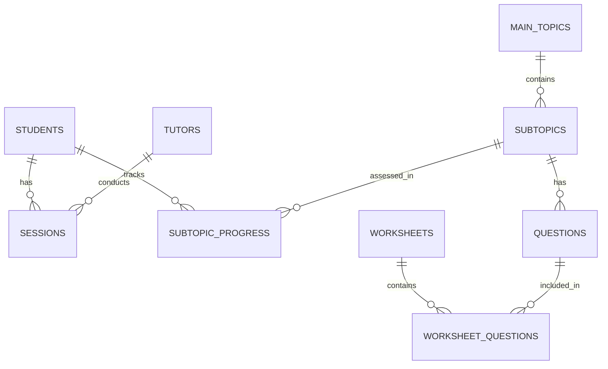

# TutorAI

# 🎯 Tutor AI - Intelligent Student Progress Tracking System

<div align="center">


**A comprehensive web-based tutoring management system designed to track student progress, identify learning patterns, and generate personalized worksheets using AI.**

[Features](#-features) • [Architecture](#-architecture) • [Roadmap](#-roadmap)

</div>

---

## Overview

Tutor AI is a full-stack web application that revolutionizes how private tutors manage their students' learning journey. Built with a focus on UK curriculum mathematics (adaptable to other subjects), it provides intelligent insights into student performance and automates worksheet generation based on individual learning needs.

### Problem Statement

Private tutors often struggle with:
- **Tracking Progress**: No centralized system to monitor student performance over time
- **Identifying Patterns**: Difficulty spotting trends in topic mastery across multiple students
- **Session Planning**: Time-consuming preparation for personalized lesson content
- **Parent Communication**: Lack of professional progress reporting tools

### Solution

Tutor AI provides a comprehensive platform that:
- Tracks detailed progress with a 1-10 mastery scale for each subtopic
- Visualizes learning trends with intuitive dashboards
- Generates AI-powered worksheets tailored to individual weaknesses
- Supports multiple tutors with role-based access control
- Offers mobile-responsive design for on-the-go session logging

---

## Features

### Core Functionality

- **Student Management**
  - Comprehensive student profiles with contact information
  - Progress tracking across all curriculum topics
  - Session history and attendance records
  - Visual progress indicators and mastery levels

- **Hierarchical Curriculum Structure**
  - Main topics → Subtopics organization
  - Customizable difficulty levels
  - UK curriculum-aligned content (expandable to other curricula)
  - Color-coded topic visualization

- **Smart Session Recording**
  - Touch-optimized mastery level sliders (1-10 scale)
  - Real-time progress updates
  - Session notes and observations
  - Multi-topic assessment in single session

- **Multi-Tutor Support**
  - Secure authentication system
  - Role-based permissions (Admin/Tutor)
  - Individual tutor dashboards
  - Session attribution and tracking

- **Intelligent Worksheet Generation** *(In Development)*
  - AI-powered question generation
  - Difficulty-based question selection
  - PDF export with customizable layouts
  - Progress-aware content targeting

### Technical Highlights

- **Responsive Design**: Mobile-first approach with touch-optimized controls
- **Modern UI/UX**: Clean, intuitive interface with customizable themes
- **RESTful Architecture**: Modular blueprint structure for scalability
- **Database Migrations**: Seamless upgrades without data loss
- **Security**: Flask-Login integration with session management

### Database Schema

<details>
<summary>Click to view ERD</summary>



</details>

---

## Architecture

### Technology Stack

| Layer | Technology | Purpose |
|-------|------------|---------|
| **Frontend** | HTML5, CSS3, JavaScript | Responsive UI with modern design |
| **Backend** | Flask 2.0+ | RESTful API and server-side logic |
| **Database** | SQLite | Lightweight, portable data storage |
| **Authentication** | Flask-Login | Secure user session management |
| **PDF Generation** | ReportLab | Professional worksheet creation |
| **AI Integration** | OpenAI API *(planned)* | Dynamic question generation |

### Project Structure

```
tutor-ai/
├── 📁 data/                    # SQLite database
│   └── tutor_ai.db
├── 📁 web/                     # Flask application
│   ├── 📁 auth/               # Authentication blueprint
│   ├── 📁 student/            # Student management
│   ├── 📁 tutor/              # Tutor management
│   ├── 📁 session/            # Session recording
│   ├── 📁 topic/              # Curriculum management
│   ├── 📁 worksheet/          # Worksheet generation
│   ├── 📁 static/             # CSS, JS, images
│   ├── 📁 templates/          # Jinja2 templates
│   └── app.py                 # Application entry point
├── 📄 database.py             # Database models and setup
├── 📄 requirements.txt        # Python dependencies
└── 📄 README.md              # This file
```


---

## Roadmap

### Completed Features

- [x] Multi-tutor authentication system
- [x] Comprehensive student management
- [x] Hierarchical topic structure
- [x] Touch-optimized progress tracking
- [x] Responsive web interface
- [x] Session recording with notes
- [x] Progress visualization
- [x] Database migration tools

### In Development

- [ ] Question bank population
- [ ] PDF worksheet generation
- [ ] AI integration for questions
- [ ] Performance optimizations

### Future Enhancements

- [ ] **Analytics Dashboard**
  - Learning velocity tracking
  - Predictive progress modeling
  - Comparative student analysis
  
- [ ] **Parent Portal**
  - Progress report generation
  - Automated email notifications
  - Homework tracking
  
- [ ] **Mobile Applications**
  - Native iOS/Android apps
  - Offline mode support
  - Camera integration for worksheet scanning

- [ ] **Advanced Features**
  - Video session recording
  - Real-time collaboration tools
  - Integration with popular LMS platforms

---

## Testing

Run the test suite:
```bash
python test_core_features.py
python health_check.py
```

---


## 📬 Contact

**Josh Beal** - [joshbeal023@gmail.com](mailto:your.joshbeal023@gmail.com)

---


# Tutor AI – Personalised Progress Tracker for Tutors

A lightweight tool built for private tutors to track student progress in 7+ UK school-level Maths, identify topic strengths/weaknesses, and automatically generate personalised worksheets for upcoming sessions using AI.

---

## Project Purpose

Many tutors lack a structured system to:
- Track student performance over time
- Identify trends in topic mastery
- Know what to focus on in the next session

**Tutor AI** solves this by acting as a central, intelligent database that logs sessions, monitors topic performance, and uses AI to create tailored practice material.

---

## Project Outcome

- A simple UI where tutors can:
  - Log students and sessions
  - View topic-level trends per student
  - Instantly generate custom worksheets using GPT
- A local SQLite database to persist student data
- A scalable Python backend that could later be deployed or extended into a web app

---

## Tech Stack

| Tool         | Purpose                          | Status |
|--------------|----------------------------------|--------|
| Python       | Core logic and AI integration    | Active |
| SQLite       | Lightweight local database       | Active |
| VSCode       | Development environment          | Active |
| OpenAI API   | Worksheet and question generation | Planned |
| GitHub       | Version control                  | Active |
| Flask        | Frontend/UI                      | Active |

---

## Roadmap – Steps to Complete

### Phase 1: Planning & Setup 
- [x] Define goal, user (tutors), and data structure
- [x] Set up GitHub repo and folder structure
- [x] Create README with comprehensive roadmap
- [x] Hierarchical topic structure (main topics → subtopics)
- [x] 1-10 mastery scale implementation
- [x] SQLite database schema design

### Phase 2: Core Database & CLI 
- [x] Set up SQLite schema for Students, Sessions, Topics
- [x] Build Python functions to insert/query session data
- [x] Logic to update topic performance tracking
- [x] Progress tracking with completion percentages
- [x] Working CLI interface with session entry
- [x] Subtopic search functionality
- [x] Multi-tutor authentication system
- [x] Database migration tools for upgrades

### Phase 3: Web Interface MVP 
- [x] Flask app setup with modular blueprint structure
- [x] Professional dashboard with statistics overview
- [x] Mobile-optimized session entry form with touch-friendly sliders
- [x] Complete student management (add/edit/delete/view progress)
- [x] Comprehensive progress visualization with color-coded indicators
- [x] Multi-tutor concurrent access with role-based permissions
- [x] Modern, responsive design with customizable CSS themes
- [x] Cross-device compatibility (desktop, tablet, mobile)
- [x] Secure tutor login system with Flask-Login
- [x] Topic and subtopic management interface
- [x] Detailed student progress reports with mastery tracking
- [x] Session logging with subtopic assessment integration

### Phase 4: Code Architecture & Polish 
- [x] Modular Flask blueprint structure (/auth, /student, /tutor, /session, /topic)
- [x] Service layer separation for business logic
- [x] Database utilities and connection management
- [x] Comprehensive error handling and flash messaging
- [ ] **Code documentation and inline comments**
- [ ] **Unit tests for core functionality**
- [ ] **Configuration management (dev/prod environments)**
- [ ] **Data validation and input sanitization**
- [ ] **Performance optimization and query efficiency**

### Phase 5: Worksheet Generator & AI Integration
- [ ] Question bank database structure with categorization
- [ ] Basic question templates by subtopic and difficulty level
- [ ] Smart worksheet generation algorithm focusing on weak areas
- [ ] PDF generation for printable worksheets with proper formatting
- [ ] Worksheet tracking system (generated → assigned → completed)
- [ ] OpenAI API integration for dynamic question creation
- [ ] Worksheet library and template management
- [ ] Student worksheet history and performance tracking
- [ ] Custom worksheet difficulty adjustment based on mastery levels

### Phase 6: Deployment & Production
- [ ] Environment configuration for production deployment
- [ ] Deploy to cloud platform (Railway/Render/Heroku/DigitalOcean)
- [ ] Custom domain setup and SSL certificate
- [ ] Database backup and recovery procedures
- [ ] Performance monitoring and logging
- [ ] User acceptance testing with real tutors
- [ ] Comprehensive user documentation and tutorials
- [ ] Security audit and penetration testing

### Phase 7: Advanced Features
- [ ] **Analytics Dashboard**
  - [ ] Student progress trends over time
  - [ ] Topic difficulty analysis across students
  - [ ] Tutor performance metrics and insights
  - [ ] Predictive modeling for student outcomes
- [ ] **Parent Portal**
  - [ ] Progress reports (PDF export)
  - [ ] Parent login system with limited access
  - [ ] Email notifications for milestones
  - [ ] Homework and assignment tracking
- [ ] **Enhanced Assessment**
  - [ ] Worksheet scanning & auto-grading capability
  - [ ] Voice note recording for session observations
  - [ ] Photo upload for written work samples
  - [ ] Custom assessment rubrics by topic

### Phase 8: Platform Expansion
- [ ] **Multi-Subject Support**
  - [ ] English/Literacy curriculum integration
  - [ ] Science topics and practical assessments
  - [ ] Language learning modules
  - [ ] Custom subject creation tools
- [ ] **Advanced Integrations**
  - [ ] Integration with popular tutoring management systems
  - [ ] Calendar integration for session scheduling
  - [ ] Payment processing for online tutoring
  - [ ] Video conferencing integration
- [ ] **Mobile Application**
  - [ ] Native iOS/Android app development
  - [ ] Offline mode for session entry
  - [ ] Push notifications for assignments
  - [ ] Camera integration for worksheet scanning

---

## Time Log

| Date | Time Spent (Hours) | Tasks Completed |
|------|------------|-----------------|
| 23.05.25 | *1.5* | Set up github repo and folder structure, created readme |
| 27.05.25 | *3.5* | Created data base with dummy names, created access to data base |
| 28.05.25 | *4* | Code changes, readme changes, roadmap updates|
| 29.05.25 | *6* | Local flask website successfully launched |
| 02.06.25 | *3.5* | Added log in abilities for tutors |
| 03.06.25 | *1.5* | File Restructure |
| 17.06.25 | *2* | Topics + subtopic integration |
| 27.06.25 | *1.5* | Migrating databases + adding worksheets |
| 08.07.25 | *1.5* | System Health checks and worksheet prep | 
| 14.07.25 | *4* | Worksheet generation + subtopic question bank implementation |
| 16.07.25 | *3* | Question population and worksheet |
| 17.07.25 | *2.5* | Database entry errors and answers bug fixing |
| 21.07.25 | 1.5 | Menu drop downs |
| 22.07.25 | 2.5 | Reformatting student progress |
| 23.07.25 | 3 | Generalised question preparation |
| 22.07.25 |  |  |


